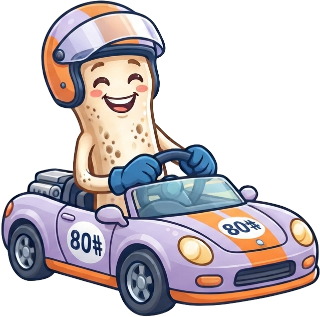
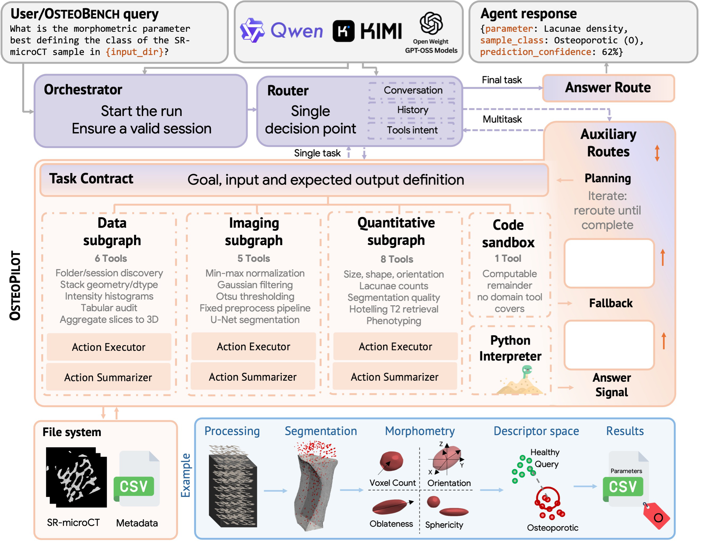

#  OsteoPilot

> A multi-agent AI assistant for osteoporosis research at the bone microscale.

[](environment.yml) [](https://github.com/langchain-ai/langgraph) [](https://ollama.com) [](osteobench) [](#citation)

OsteoPilot is a tool-using multi-agent system for Synchrotron-Radiation micro-CT (SR-microCT) bone image analysis. Bone microscale research is a workflow domain rather than a single-shot prediction task: a question such as *"do the lacunae in these two samples differ?"* requires discovering the data on disk, converting a TIFF stack into a volume, preprocessing it, segmenting lacunae, extracting morphometry, perform reasearch around phenotypes and only then running a statistical comparison. OsteoPilot plans that pipeline, routes each step to a domain specialist, calls the appropriate imaging tool, and keeps every produced artifact registered in a session so the trace can be audited end to end.

<p align="center">
  
</p>

A query from a user or from OsteoBench enters the **Orchestrator**, which starts the run and ensures a valid session. A single **Router** then makes every dispatch decision, reading the conversation, the run history, and the tool intent. Work leaving the router is packaged as a **Task Contract** that fixes the goal, the inputs, and the expected output, then handed to one of three domain subgraphs (Data, Imaging, Quantitative) or to the code sandbox when no specialist tool covers the request. Each subgraph pairs an **Action Executor** with an **Action Summarizer**, so a step returns compact state rather than a raw tool dump. Auxiliary routes iterate and reroute until a multi-step task is complete, provide a fallback, and raise the answer signal that releases the final response through the Answer Route. 

This repository contains both halves of the project: the **agent** (`multiagent/`) and **OsteoBench** (`osteobench/`), a 68-question, execution-scored benchmark for tool-using agents on this workflow. OsteoBench scores the whole execution trace (routing, task scope, tool use, artifacts, and final answer), so a plausible answer reached through an invalid path (fabricated numbers, a skipped preprocessing step, the wrong tool) is not rewarded as correct.

Biomedical datasets are **not** distributed with this repository. SR-microCT acquisitions are institution-specific, reach terabyte scale, and usually carry data-sharing restrictions. What is released is the task and evaluation layer on top of them, so other groups can point the same question set at their own SR-microCT data. See [`osteobench/DATASHEET.md`](osteobench/DATASHEET.md).

> Giannetto\*, Poles\*, Santambrogio, D'Arnese.
> **A Multi Agent AI Assistant for Osteoporosis Research at the Bone Microscale.**
> ECCV 2026 BioImage Computing workshop. Proceedings not yet available.
>
> \*Equal contribution. Politecnico di Milano, Italy, and University of Edinburgh, United Kingdom.

**Funding.** We acknowledge ISCRA for awarding this project access to the LEONARDO supercomputer, owned by the EuroHPC Joint Undertaking and hosted by CINECA (Italy). Some parts of this work was supported by the Polisocial Award 2022, Politecnico di Milano.

### Key Features

- **Router-first multi-agent topology.** A supervisor router dispatches each step to one of three domain subgraphs, with a code sandbox and a todo planner available when no specialist tool fits.
- **Specialist imaging tools, not just code generation.** 19 purpose-built tools across the three subgraphs cover TIFF to NIfTI intake, volume QA, intensity preprocessing, U-Net lacunae segmentation, morphometry, segmentation metrics, pehnotyping and KNN patient comparison, instead of asking the model to reinvent each step in Python.
- **Session-scoped artifacts.** Volumes, masks, and CSVs produced mid-run are registered as artifacts and passed between subgraphs by reference, so multi-step workflows stay grounded in real files.
- **Execution-scored evaluation.** OsteoBench grades each run against a 13-point rubric across five dimensions (routing, task scope, tools, artifacts, final output), not just final-answer accuracy.
- **Built-in ablation baselines.** The same benchmark runs against the full multi-agent graph, a Python-interpreter-only agent (with and without retries), a flat single-agent tool setup, and a no-tool LLM, each as a separate compiled graph.
- **Runs on open models.** Any Ollama-served model, locally or via Ollama Cloud. No proprietary API required.

### 1. Requirements

- Linux x86-64
- Conda
- An Ollama server or an Ollama Cloud account
- An NVIDIA GPU is optional. GPU-enabled tools use CUDA when available and fall back to CPU where supported.

### 2. Installation

```bash
git clone <OSTEOPILOT_REPOSITORY_URL> OsteoPilot
cd OsteoPilot
conda env create -f environment.yml
conda activate bonesai-agent
cp multiagent/.env.example multiagent/.env
```

Then set `MODEL_NAME` in `multiagent/.env`. For a local Ollama server:

```dotenv
MODEL_NAME=<OLLAMA_MODEL_NAME>
OLLAMA_BASE_URL=http://localhost:11434
```

For Ollama Cloud:

```dotenv
MODEL_NAME=<OLLAMA_CLOUD_MODEL_NAME>
OLLAMA_BASE_URL=https://ollama.com
OLLAMA_API_KEY=<OLLAMA_API_KEY>
```

### 3. Pointing OsteoPilot at your data

Relative paths, both in OsteoBench specifications and in your own questions, resolve against `BIOMED_WORKSPACE_ROOT`. Set it whenever the data live outside the repository:

```dotenv
BIOMED_WORKSPACE_ROOT=/path/to/biomedical-workspace
```

A typical layout, one directory of TIFF slices per sample:

```text
biomedical-workspace/
└── data/
    └── dataset_a/
        ├── T1_S7step0_Z0/
        └── T1_S26step1_Z0/
```

KNN patient comparison additionally needs an external reference library of per-sample morphometry, which is also not distributed here. Its required layout is documented in [`multiagent/KNN_REFERENCE_LIBRARY.md`](multiagent/KNN_REFERENCE_LIBRARY.md).

### What is not distributed: the morphometric extraction backend

Morphometric extraction in this work was performed with a software that has since become a commercial product, so it cannot be released with this repository. What is made available is everything built around it:

- The **agent-side tool**, [`lacunae_morphometry_tool.py`](multiagent/src/agent/tools/lacunae_morphometry_tool.py), with the full input and output contract the agent sees: the arguments it accepts, the artifacts it registers, and the per-lacuna parameter table it returns.
- The **parameter computation script**, [`multiagent/framework/lacune_parameters_blocks_nii.py`](multiagent/framework/lacune_parameters_blocks_nii.py), so the morphometric definitions, the block-wise processing, and the returned columns are all inspectable. It imports the proprietary backend at module level, so it documents the method rather than running standalone.
- The **benchmark questions and evaluation profiles** that exercise morphometry, which score routing, tool use, and artifacts independently of which backend produced the numbers.

The tool degrades gracefully when the backend is absent: the import failure is logged and recorded, and the rest of the agent continues to work. To reproduce the morphometry and phenotyping results, substitute your own backend behind the same tool contract. If you would like to use the original software instead, get in touch and we will gladly put you in contact with the people behind the product.

### 4. Quickstart

Launch the agent in LangGraph Studio and talk to it interactively:

```bash
./run_langGraph.sh
```

The script loads `multiagent/.env`, sets `PYTHONPATH`, and starts `langgraph dev`. The graphs registered in [`multiagent/langgraph.json`](multiagent/langgraph.json) appear in the Studio graph selector; `full_weak` is the complete system, the rest are baselines.

### 5. Architecture

The figure at the top of this page shows the full topology. The router is the single decision point: it inspects the conversation, the run history, and the tool intent, then picks the next destination. Domain subgraphs own their own tools and cannot reach into each other's:

| Subgraph | Tools | Handles | Representative tools |
| :-- | --: | :-- | :-- |
| `filesystem_and_format_intake` | 6 | Folder and session discovery, volume geometry and dtype QA, dynamic range, intensity histograms, tabular audit, TIFF to NIfTI conversion | `folder_listing_with_sizes`, `volume_metadata_audit`, `volume_histogram`, `tiff_folder_to_nifti` |
| `imaging_manipulation` | 5 | Min-max normalization, Gaussian filtering, Otsu thresholding, fixed preprocessing pipelines, U-Net lacunae segmentation | `image_intensity_preprocessing`, `standard_microscopy_preprocessing`, `microscopy_segmentation` |
| `quantitative_imaging_analysis` | 8 | Size, shape and orientation morphometry, lacunae counts, segmentation quality, Hotelling T² KNN retrieval, phenotyping | `lacunae_morphometry`, `patient_similarity_hotelling_t2`, `segmentation_metrics`, `mask_component_analysis` |

Alongside these sit a **code sandbox** holding a Python interpreter, used for the computable remainder that no domain tool covers, and **todo planning tools** for multi-step workflows. Within a subgraph, an Action Executor runs the chosen tool and an Action Summarizer condenses the result back into session state. Every run is captured by an execution recorder, which is what OsteoBench later scores.

### 6. Evaluating with OsteoBench

[`osteobench/`](osteobench) holds five JSON specifications that follow the analysis pipeline end to end:

| File | # questions | Covers |
| :-- | --: | :-- |
| [`data_qa.json`](osteobench/data_qa.json) | 10 | Data inspection |
| [`preprocessing_qa.json`](osteobench/preprocessing_qa.json) | 8 | Preprocessing |
| [`segmentation_qa.json`](osteobench/segmentation_qa.json) | 10 | Segmentation |
| [`phenotyping_qa.json`](osteobench/phenotyping_qa.json) | 25 | Morphometry & classification |
| [`statistics_qa.json`](osteobench/statistics_qa.json) | 15 | Segmentation evaluation & leave-one-out |

Each question carries a natural-language `question`, `additional_instructions`, an explicit `output_instructions` contract, and a machine-checkable `evaluation` profile encoding the expected execution path. Their data paths are relative to `BIOMED_WORKSPACE_ROOT`.

The interactive runner asks which specifications to execute:

```bash
./evaluation/run_evaluation.sh
```

Results are written under `evaluation/output/` (git-ignored) unless `EVALUATION_DIR` is set. To run a single specification, or selected questions, call the evaluator directly:

```bash
python evaluation/evaluator.py --spec-file osteobench/data_qa.json --human
python evaluation/evaluator.py --spec-file osteobench/data_qa.json --task-id data_qa_1 --output summary.json
```

| Flag | Purpose |
| :-- | :-- |
| `--spec-file PATH` | Specification JSON to run. Required. |
| `--task-id ID` | Run selected questions only. Repeatable. |
| `--graph NAME` | Which compiled graph to evaluate. Default: `full_weak`. |
| `--human` | Print a compact human-readable rubric summary. |
| `--output PATH` | Write the full machine-readable result JSON. |
| `--workspace-root PATH` | Override where relative task paths resolve. |
| `--render-task-templates` | Resolve placeholders such as `{volume_relative_path}` before execution. |
| `--preprocess-only` | Print the rendered specification without running the graph. |

Aggregate plots over completed runs:

```bash
python evaluation/plot_results.py
```

### 7. Scoring

Every question is scored out of **13 points**, one per rubric check, grouped into five dimensions. Each check is also tagged with a category (Correctness, Completeness, Efficiency, or Quality), so failure modes can be read off directly.

| Dimension | Checks | Asks |
| :-- | :-- | :-- |
| **A. Routing** | `correct_primary_route`, `no_forbidden_routes`, `no_redundant_routes`, `required_routes_present` | Did the router send the work to the right specialists, and only those? |
| **B. Subgraph task** | `task_scope_adherence`, `no_redundant_task` | Was the delegated task faithful to the question and not padded? |
| **C. Tools** | `correct_tools_called`, `correct_tool_order`, `sandbox_first_attempt` | Were the right tools used, in a valid order, without falling back to raw code first? |
| **D. Artifacts** | `artifacts_created`, `artifact_type_correct`, `artifact_registered_in_session` | Did the run produce real, correctly typed, session-registered outputs? |
| **E. Final output** | `final_output_correct` | Does the answer satisfy the `output_instructions` contract? |

### 8. Reproducing the ablations

Each architecture is a separately compiled graph, so a baseline is one flag away. Select it with `--graph`, or with `EVALUATION_GRAPH` for the interactive runner; each graph writes to its own output tree so runs never collide.

| Graph | Architecture |
| :-- | :-- |
| `full_weak` | Full multi-agent system: router, domain subgraphs, specialist tools; reduced constraint prompt. |
| `full_strong` | The same topology under a strong constraint prompt. |
| `single_agent_weak` | All domain tools flat in one agent, no router; reduced constraint prompt. |
| `single_agent_strong` | The same flat setup under a strong constraint prompt. |
| `pi_retries_weak` | Python interpreter only, with retries; reduced constraint prompt. |
| `pi_retries_strong` | Python interpreter only, with retries; strong constraint prompt. |
| `pi_single` | Python interpreter only, a single execution attempt. |
| `llm_only` | Direct LLM response: no tools, no code execution. |

Graph names follow `AgentMode` exactly. `BIOMED_GRAPH_NAME` sets the default for both entry points.

```bash
EVALUATION_GRAPH=pi_retries_weak ./evaluation/run_evaluation.sh
```

### Repository layout

```text
OsteoPilot/
├── multiagent/
│   ├── src/agent/            # router, subgraphs, tools, prompts, execution recorder
│   ├── framework/            # SR-microCT / bone-remodelling support library
│   └── langgraph.json        # registered graphs
├── osteobench/               # benchmark specifications + DATASHEET
├── evaluation/               # evaluator, runner, run index, plots
└── environment.yml
```

### Citation

If you use OsteoPilot or OsteoBench, please cite:

> Matteo Giannetto\*, Isabella Poles\*, Marco D. Santambrogio, and Eleonora D'Arnese. **A Multi Agent AI Assistant for Osteoporosis Research at the Bone Microscale.** ECCV 2026 BioImage Computing workshop. \*Equal contribution.

The proceedings are not yet available; the BibTeX entry will be added here as soon as they are published.

### Contact

Questions, issues, or contributions: Matteo Giannetto ([matteo.giannetto@mail.polimi.it](mailto:matteo.giannetto@mail.polimi.it)) and Isabella Poles ([isabella.poles@polimi.it](mailto:isabella.poles@polimi.it)), Politecnico di Milano.
